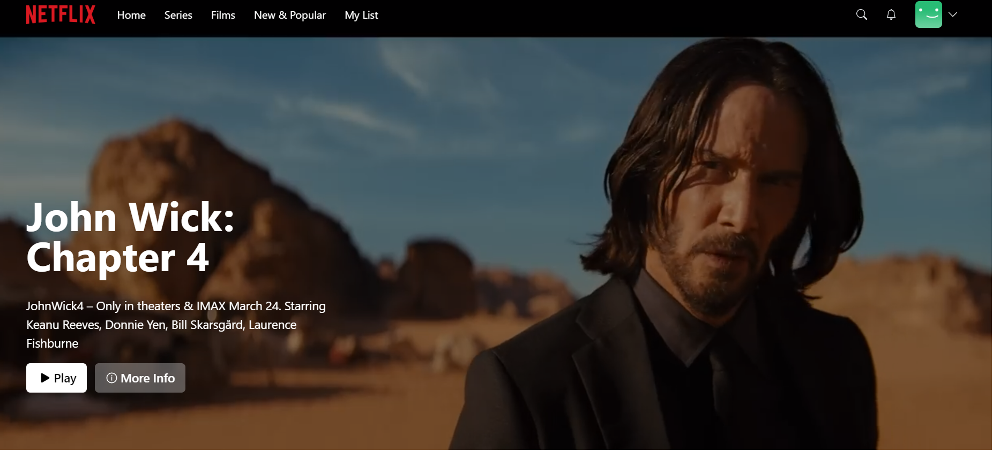
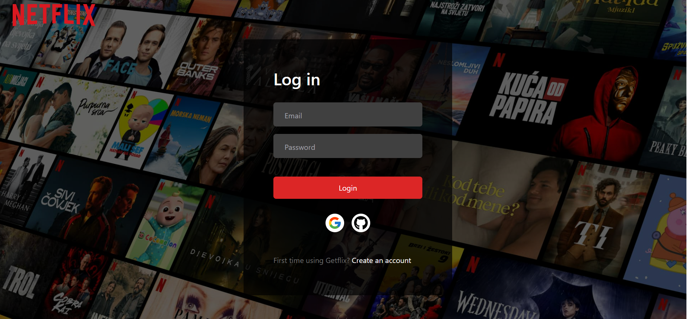
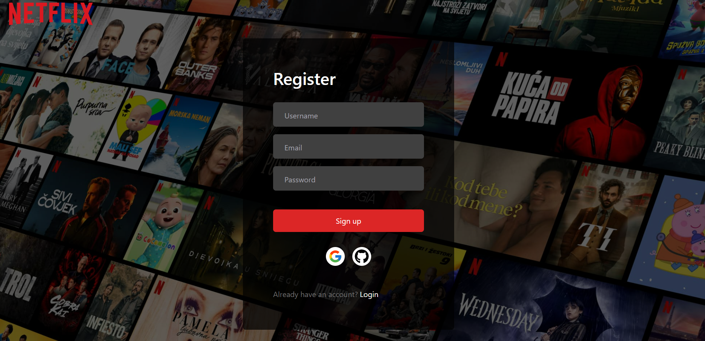
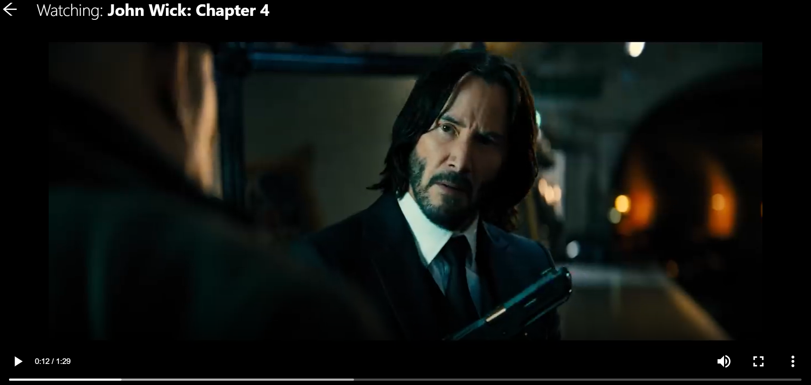
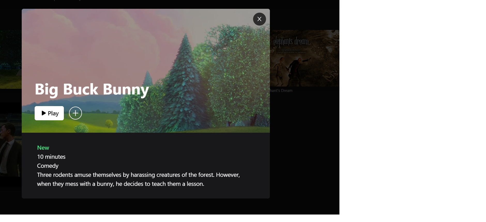
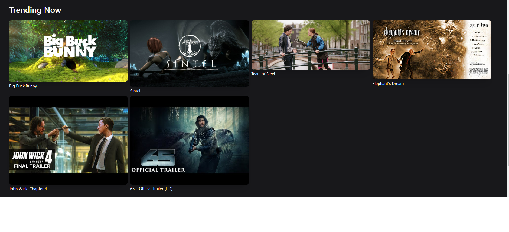

## Screenshots

## Hero 
The home page


### Entring modal



## Movie night


## Trending now && Movie details


## Technologies
- React
- Typescript
- Next.js
- Next/auth
- Prisma
- Bcrypt
- SWR
- Zustand (for mini store)

## Styling
- Tailwindcss - 

This is my first time using it and it is very nice framework for easy styling your app.
its work good with the extension

## Getting Started

First, run the development server:
npm run dev
# or
yarn dev
# or
pnpm dev
```
Open [http://localhost:3000](http://localhost:3000) with your browser to see the result.

You can start by sign-in with email and password and username.

You can chack the website here: (https://getflix-sigma.vercel.app/)

## Author
- [@Ofek Ashkenazi](https://github.com/OfekAshkenazi/)
